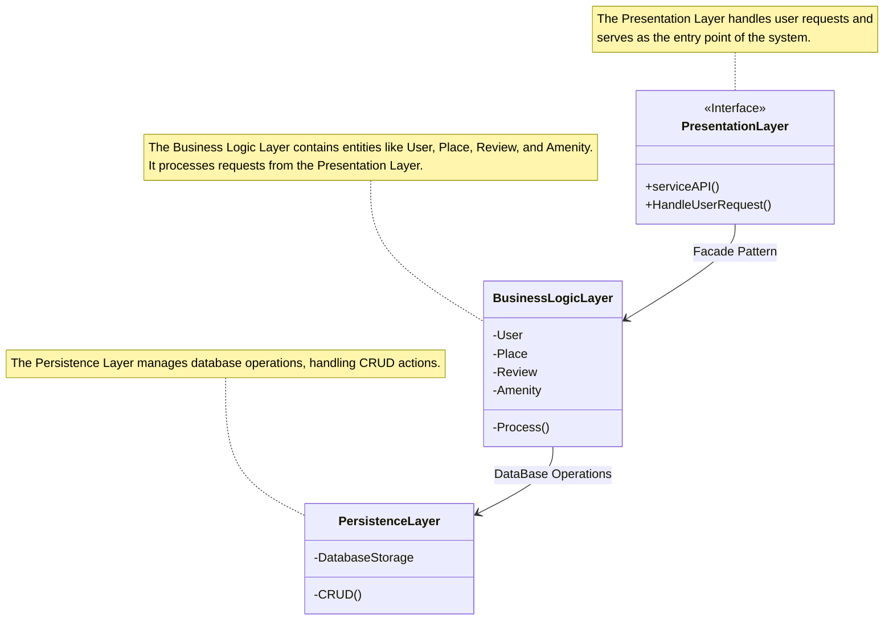

```mermaid
classDiagram

note for PresentationLayer "The Presentation Layer handles user requests and 
serves as the entry point of the system."

class PresentationLayer {
    <<Interface>>
    
    +serviceAPI()
    +HandleUserRequest()
}
note for BusinessLogicLayer "The Business Logic Layer contains entities like User, Place, Review, and Amenity.
It processes requests from the Presentation Layer."

class BusinessLogicLayer {
    -User
    -Place
    -Review
    -Amenity
    -Process()
}

note for PersistenceLayer "The Persistence Layer manages database operations, handling CRUD actions."


class PersistenceLayer {
    -DatabaseStorage
    -CRUD()
}

PresentationLayer --> BusinessLogicLayer : Facade Pattern
BusinessLogicLayer --> PersistenceLayer : DataBase Operations
```
