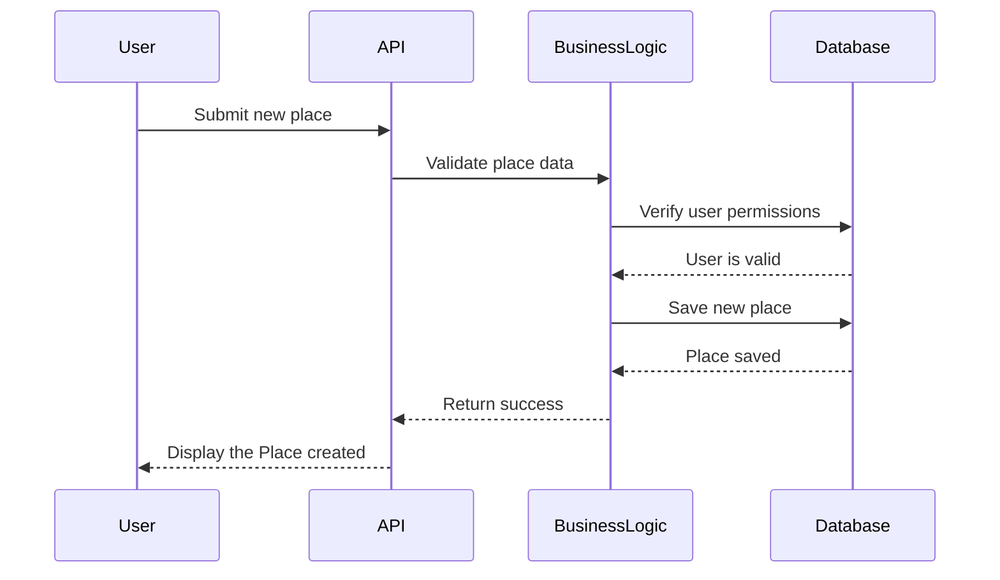

```mermaid
sequenceDiagram
    participant User
    participant API
    participant BusinessLogic
    participant Database

    User->>API: Submit new place
    API->>BusinessLogic: Validate place data
    BusinessLogic->>Database: Verify user permissions
    Database-->>BusinessLogic: User is valid
    BusinessLogic->>Database: Save new place
    Database-->>BusinessLogic: Place saved
    BusinessLogic-->>API: Return success
    API-->>User: Display the Place created
```
