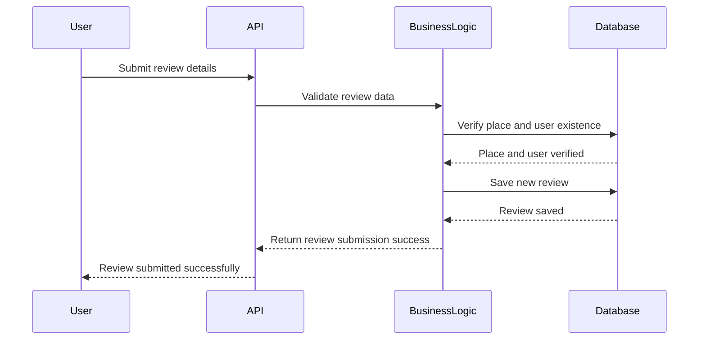

```mermaid
sequenceDiagram
    participant User
    participant API
    participant BusinessLogic
    participant Database

    User->>API: Submit review details
    API->>BusinessLogic: Validate review data
    BusinessLogic->>Database: Verify place and user existence
    Database-->>BusinessLogic: Place and user verified
    BusinessLogic->>Database: Save new review
    Database-->>BusinessLogic: Review saved
    BusinessLogic-->>API: Return review submission success
    API-->>User: Review submitted successfully 
```
