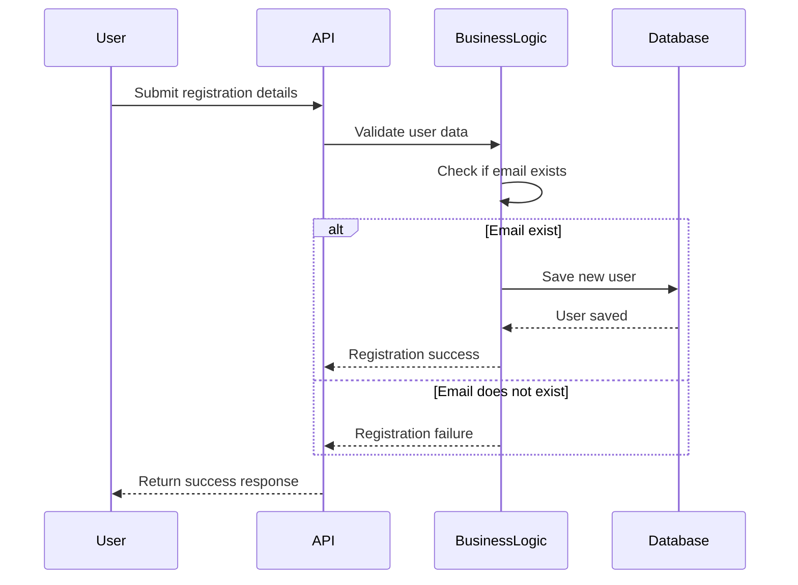

```mermaid
sequenceDiagram

    participant User
    participant API
    participant BusinessLogic
    participant Database

    User->>API: Submit registration details
    API->>BusinessLogic: Validate user data
    
    BusinessLogic->>BusinessLogic: Check if email exists

    alt Email exist
        BusinessLogic->>Database: Save new user
        Database-->>BusinessLogic: User saved
        BusinessLogic-->>API: Registration success
    else Email does not exist
        BusinessLogic-->>API: Registration failure
    end
    
    API-->>User: Return success response
```
