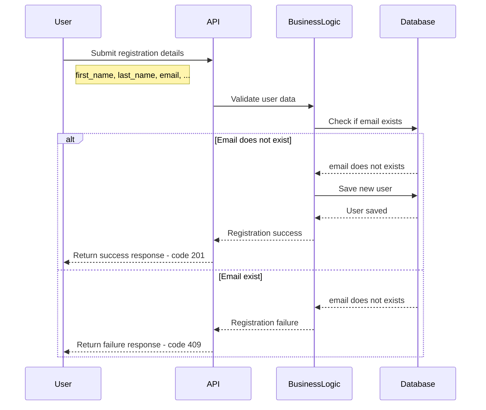

```mermaid
sequenceDiagram

    participant User
    participant API
    participant BusinessLogic
    participant Database

    User->>API: Submit registration details
    note right of User: first_name, last_name, email, ...
    API->>BusinessLogic: Validate user data
    
    BusinessLogic->>Database: Check if email exists

    alt Email does not exist
        Database-->>BusinessLogic: email does not exists
        BusinessLogic->>Database: Save new user
        Database-->>BusinessLogic: User saved
        BusinessLogic-->>API: Registration success
        API-->>User: Return success response - code 201
    else Email exist
        Database-->>BusinessLogic: email does not exists
        BusinessLogic-->>API: Registration failure
        API-->>User: Return failure response - code 409
    end
```
