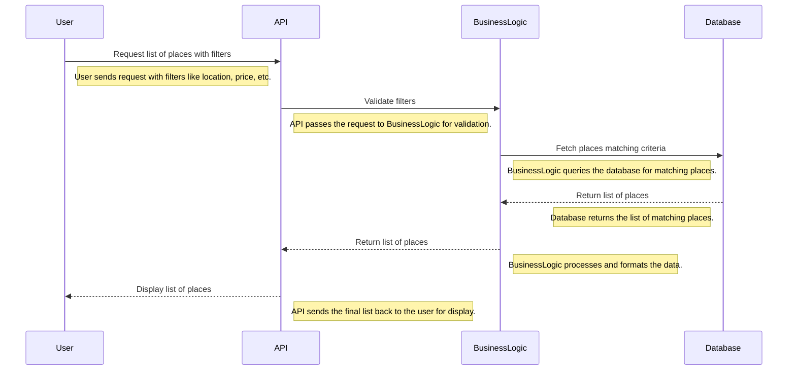

```mermaid
sequenceDiagram
    participant User
    participant API
    participant BusinessLogic
    participant Database

    User->>API: Request list of places with filters
    note right of User: User sends request with filters like location, price, etc.
    
    API->>BusinessLogic: Validate filters
    note right of API: API passes the request to BusinessLogic for validation.
    
    BusinessLogic->>Database: Fetch places matching criteria
    note right of BusinessLogic: BusinessLogic queries the database for matching places.
    
    Database-->>BusinessLogic: Return list of places
    note left of Database: Database returns the list of matching places.
    
    BusinessLogic-->>API: Return list of places
    note right of BusinessLogic: BusinessLogic processes and formats the data.
    
    API-->>User: Display list of places
    note right of API: API sends the final list back to the user for display.
```
