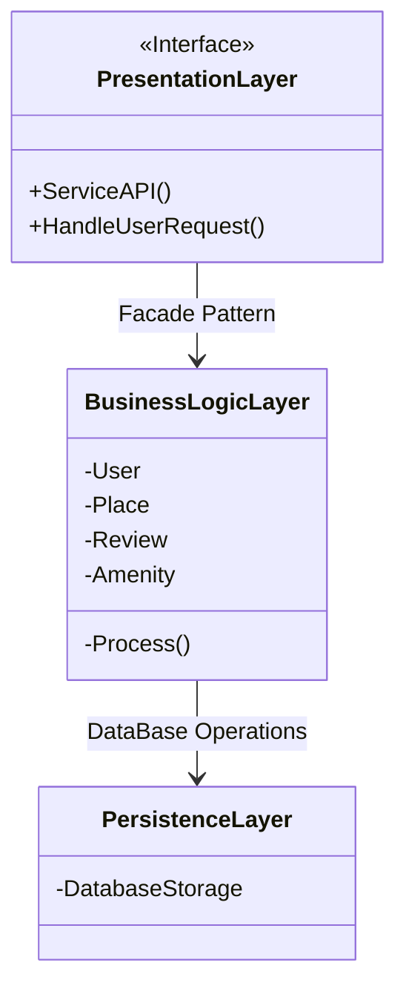

```mermaid
classDiagram

class PresentationLayer {
    <<Interface>>
    +ServiceAPI()
    +HandleUserRequest()
}
class BusinessLogicLayer {
    -User
    -Place
    -Review
    -Amenity
    -Process()
}
class PersistenceLayer {
    -DatabaseStorage
}

PresentationLayer --> BusinessLogicLayer : Facade Pattern
BusinessLogicLayer --> PersistenceLayer : DataBase Operations
```
