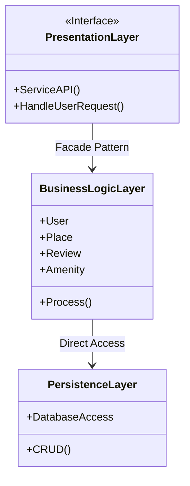

```mermaid
classDiagram

class PresentationLayer {
    <<Interface>>
    +ServiceAPI()
    +HandleUserRequest()
}
class BusinessLogicLayer {
    +User
    +Place
    +Review
    +Amenity
    +Process()
}
class PersistenceLayer {
    +DatabaseAccess
    +CRUD()
}

PresentationLayer --> BusinessLogicLayer : Facade Pattern
BusinessLogicLayer --> PersistenceLayer : Direct Access
```
