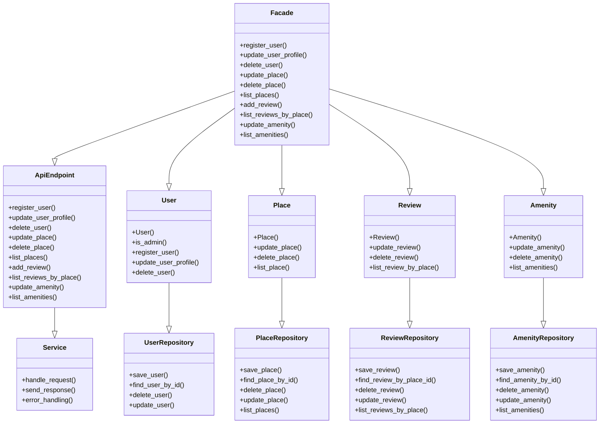

```mermaid

classDiagram
direction TB
class Service {
  +handle_request()
  +send_response()
  +error_handling()
}

class ApiEndpoint {
  +register_user()
  +update_user_profile()
  +delete_user()
  +update_place()
  +delete_place()
  +list_places()
  +add_review()
  +list_reviews_by_place()
  +update_amenity()
  +list_amenities()
}

class Facade {
  +register_user()
  +update_user_profile()
  +delete_user()
  +update_place()
  +delete_place()
  +list_places()
  +add_review()
  +list_reviews_by_place()
  +update_amenity()
  +list_amenities()
}

class User {
  +User()
  +is_admin()
  +register_user()
  +update_user_profile()
  +delete_user()
}

class Place {
  +Place()
  +update_place()
  +delete_place()
  +list_place()
}

class Review {
  +Review()
  +update_review()
  +delete_review()
  +list_review_by_place()
}

class Amenity {
  +Amenity()
  +update_amenity()
  +delete_amenity()
  +list_amenities()
}

class UserRepository {
  +save_user()
  +find_user_by_id()
  +delete_user()
  +update_user()
}

class PlaceRepository {
  +save_place()
  +find_place_by_id()
  +delete_place()
  +update_place()
  +list_places()
}

class ReviewRepository {
  +save_review()
  +find_review_by_place_id()
  +delete_review()
  +update_review()
  +list_reviews_by_place()
}

class AmenityRepository {
  +save_amenity()
  +find_amenity_by_id()
  +delete_amenity()
  +update_amenity()
  +list_amenities()
}

ApiEndpoint --|> Service
Facade --|> ApiEndpoint
Facade --|> User
Facade --|> Place
Facade --|> Review
Facade --|> Amenity
User --|> UserRepository
Place --|> PlaceRepository
Review --|> ReviewRepository
Amenity --|> AmenityRepository
```
